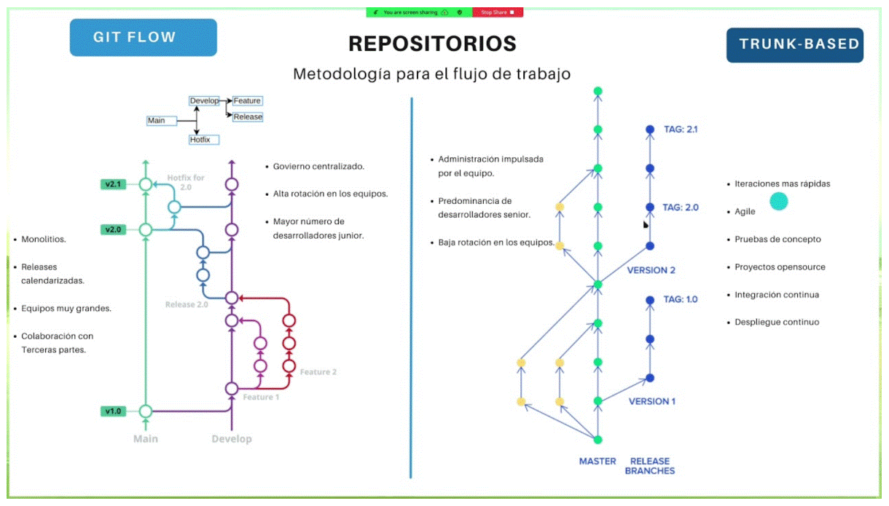
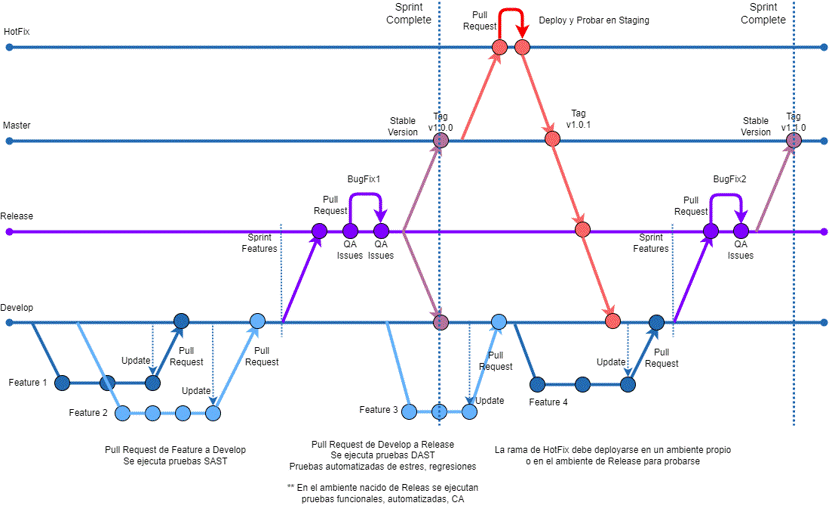
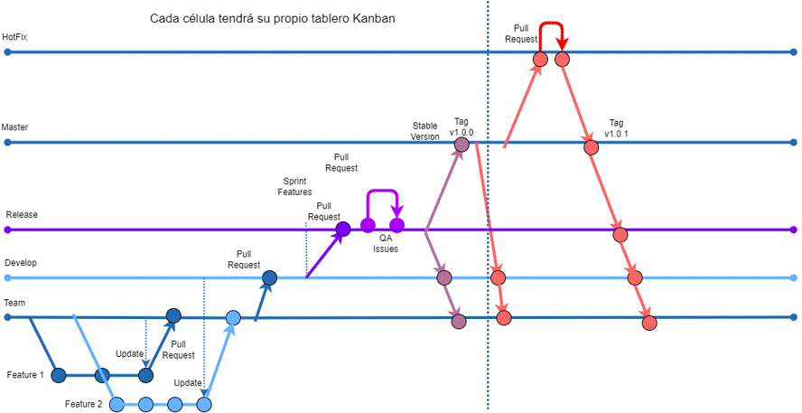

# Branching Strategy

## `Banching Models`

## `GitFlow` equipos de una célula a la vez

## `GitFlow` más de una célula a la vez

`Spanish Version`

## Ramas Develop

### `Descripción`

- Es una rama que nace de la rama principal (main/master)
- Es la rama de donde se obtendrá el ambiente de Desarrollo
- Es la rama de donde nacerán los “Features” para desarrollar cada HU
- Es la rama de integración para todos los cambios
- Es la rama de donde se obtendrán los cambios directos para el Release

### `Flujo de trabajo`

- Se genera la rama a partir de la rama (main/master)
- Se crean ramas hijas llamadas Features
- Se integran los cambios de los features
- Se genera una rama Release a partir de la última versión de Develop
- Cualquier cambio que se haga en la rama Release debe integrarse en Develop
- Cualquier Hot-fix que se haga en las ramas Master, debe integrarse en Develop

### `Formas de modificar la rama`

- Por medio de Pull Request de un Feature, Release o Hot-Fix a Develop

### `Roles que pueden hacer cambios`

- Desarrollador: Generar Features, generar el Pull Request
- Ing. Infraestructura: Generar Features, generar Pull Request
- Líder técnico: Aprobar los Pull Request
- Líder de Infraestructura: Aprobar los Pull Request
- Tester automatizador: Generar Features, generar Pull Request.

## Ramas Team

### `Descripción`

- Es una rama que nace de la rama Develop
- Es la rama de donde nacerán los “Features” para desarrollar cada HU
- Es la rama de integración para todos los cambios

### `Flujo de trabajo`

- Esta rama solo existirá en caso de que se tenga que agregar alguna otra célula que impacté el mismo componente
- Se genera la rama a partir de la rama (Develop)
- Se crean ramas hijas llamadas Features
- Se integran los cambios de los Features
- Cualquier cambio que se haga en la rama Release debe integrarse en la rama Team
- Cualquier Hotfix que se haga en las ramas Master, debe integrarse en la rama Team

### `Formas de modificar la rama`

- Por medio de Pull Request de un Feature

### `Roles que pueden hacer cambios`

- Desarrollador: Generar Features, generar el Pull Request
- Ing. Infraestructura: Generar Features, generar Pull Request
- Líder técnico: Aprobar los Pull Request
- Líder de Infraestructura: Aprobar los Pull Request
- Tester automatizador: Generar Features, generar Pull Request.

## Ramas Feature

### `Descripción`

- Es una rama “hija” que es creada a partir de la última versión de Develop, se tiene que ejecutar la acción “Pull” para obtener los últimos cambios
- Se modificarán los archivos para satisfacer las actividades de trabajo
- La convención de nombre de cada rama será:
    feature-IdTarea-ActividadEspecifica
    feature-23-AgregarCatalogo

- Una vez concluidos los cambios, el Feature es destruido
- No debe haber más Feature que desarrolladores o tareas en ejecución.

### `Flujo de trabajo`

- Se genera la rama a partir de la última versión de Develop
- Se modifica en la rama
- Se genera Pull Request del Feature hacia Develop
- Se destruye el Feature

### `Formas de modificar la rama`

- El dueño de la rama tiene que hacer commits de los cambios que se necesitan versionar
- El título del commit será el idTarea-ActividadDelCommit
     23-AgregarTabla
- La descripción commit tiene que ser una descripción breve de los cambios que se estarán guardando
- El dueño de la rama tiene que impulsar los cambios de su ambiente local al repositorio remoto

### `Roles que pueden hacer cambios`

- Desarrollador: Generar Features, generar el Pull Request
- Ing. Infraestructura: Generar Features, generar el Pull Request
- Tester automatizador: Generar Features, generar Pull Request.

## Ramas Release

### `Descripción`

- Es una rama que nace de la rama Develop
- Es la rama de donde se obtendrá el ambiente de Calidad
- Para la resolución de errores, se debe generar un Bug-Fix a partir de Release

### `Flujo de trabajo`

- Se genera la rama a partir de la rama de Develop
- Una vez creada se hace un merge de Develop a Release
- En caso de algún error se debe crear una rama Bug-Fix a partir de Release
- Cuando los cambios dentro de Release están aprobados se debe generar un Tag cuya convención de nombre será:
    Vx.x.x

- Cuando se genere el tag, los cambios serán impulsados a la rama Master y en caso de que hubo cambios se deben impulsar a Develop

### `Formas de modificar la rama`

- Se crea a partir de Develop
- Una vez creada la rama, debe hacerse un merge de Develop a Release
- Se crean ramas Bug-Fix
- Se integran los cambios de los Bug-Fix a Release

### `Roles que pueden hacer cambios`

- Desarrollador: Generar Bug-Fix, generar el Pull Request
- Ing. Infraestructura: Generar Bug-Fix, generar el Pull Request
- Líder técnico: Crear la rama, hacer el merge de Develop a Release, aceptar Pull Request
- Líder de Infraestructura: Aprobar los Pull Request

## Ramas Bug-Fix

### `Descripción`

- Es una rama que nace de la rama Release
- En esta rama se corregirán los errores que saldrán de las pruebas
- La convención de nombres de un Bug-Fix será:
    bugfix-IdIncidencia

- Una vez concluido el Bug-Fix, se debe destruir.
- No debería haber mas ramas Bug-Fix que desarrolladores o errores en ejecución.

### `Flujo de trabajo`

- Se genera la rama a partir de la última versión de Release
- Se modifica en la rama con los cambios necesarios
- Se genera el commit y se hace push
- Se genera Pull Request del Bug-Fix a Release
- Se destruye el Bug-Fix

### `Formas de modificar la rama`

- El dueño de la rama tiene que hacer commits de los cambios que se necesitan versionar
- El título del commit será el idTarea-ActividadDelCommit
     23-AgregarTabla
- El commit tiene que ser una descripción breve de los cambios que se estarán guardando
- El dueño de la rama tiene que impulsar los cambios de su ambiente local al repositorio remoto

### `Roles que pueden hacer cambios`

- Desarrollador: Generar Bug-Fix, generar el Pull Request
- Ing. Infraestructura: Generar Bug-Fix, generar el Pull Request
- Líder técnico: Aprobar los Pull Request
- Líder de Infraestructura: Aprobar los Pull Request

## Ramas Master/Main

### `Descripción`

- Es la rama principal donde solo llegarán los cambios que estén aprobados desde la rama Release
- Es la rama donde saldrá el ambiente productivo
- En caso de cualquier error deberá generarse un Hot-Fix
- Cualquier cambio que venga de un Hot-Fix deberá generar un tag nuevo

### `Flujo de trabajo`

- Es la rama principal, es la primera que nace en los proyectos
- Se genera la rama de Develop
- Cuando un Release está listo, se integran los cambios a Master para ser desplegados
- En caso de algún error se debe generar un Hot-Fix para su corrección

### `Formas de modificar la rama`

- Se hace un Merge de Release a Master
- Se aprueban Pull Request de un Hot-Fix

### `Roles que pueden hacer cambios`

- Desarrollador: Generar Hot-Fix, generar el Pull Request
- Ing. Infraestructura: Generar Hot-Fix, generar el Pull Request
- Líder técnico: Generar el merge de Release a Master, aprobar Pull Request
- Líder de Infraestructura: Aprobar los Pull Request

## Ramas Hot-Fix

### `Descripción`

- Es una rama que nace de la rama Master
- En esta rama se corregirán los errores que saldrán de los incidentes productivos
- La convención de nombres de un Hot-Fix será:
    hotfix-IdIncidencia

- Una vez concluido el Hot-Fix, se debe destruir.
- No debería haber mas ramas Hot-Fix que desarrolladores o errores en ejecución.

### `Flujo de trabajo`

- Se genera la rama a partir de la última versión de Master
- Se modifica en la rama con los cambios necesarios
- Se genera el commit y se hace push
- Cuando el HotFix esté terminado, se deberá desplegar en el ambiente de Pruebas, o en un ambiente especifico para poder probar
- Se genera Pull Request del Hot-Fix a Master
- Se destruye el Hot-Fix

### `Formas de modificar la rama`

- El dueño de la rama tiene que hacer commits de los cambios que se necesitan versionar
- El título del commit será el idTarea-ActividadDelCommit
     23-AgregarTabla
- El commit tiene que ser una descripción breve de los cambios que se estarán guardando
- El dueño de la rama tiene que impulsar los cambios de su ambiente local al repositorio remoto

### `Roles que pueden hacer cambios`

- Desarrollador: Generar Hot-Fix, generar el Pull Request
- Ing. Infraestructura: Generar Hot-Fix, generar el Pull Request
- Líder técnico: Aprobar los Pull Request
- Líder de Infraestructura: Aprobar los Pull Request

###########################################

`English Version`

## Development Branches

### `Description`

- It is a branch that is born from the main branch (main/master)
- It is the branch from which the Development environment will be obtained
- It is the branch from which the “Features” will be born to develop each HU
- It is the integration branch for all changes
- It is the branch from which the direct changes for the Release will be obtained

### `Workflow`

- The branch is generated from the branch (main/master)
- Child branches called Features are created
- Feature changes are integrated
- A Release branch is generated from the latest version of Develop
- Any changes made to the Release branch must be integrated into Develop
- Any Hot-fix that is made in the Master branches must be integrated into Develop

### `Ways to modify the branch`

- Through Pull Request of a Feature, Release or Hot-Fix to Develop

### `Roles that can make changes`

- Developer: Generate Features, generate the Pull Request
- Infrastructure Engineer: Generate Features, generate Pull Request
- Technical leader: Approve Pull Requests
- Infrastructure Leader: Approve Pull Requests
- Automated tester: Generate Features, generate Pull Request.

## Team Branches

### `Description`

- It is a branch that is born from the Develop branch
- It is the branch from which the “Features” will be born to develop each HU
- It is the integration branch for all changes

### `Workflow`

- This branch will only exist in case another cell has to be added that impacts the same component.
- The branch is generated from the branch (Develop)
- Child branches called Features are created
- Features changes are integrated
- Any changes made to the Release branch must be integrated into the Team branch
- Any Hotfix that is made in the Master branches must be integrated into the Team branch

### `Ways to modify the branch`

- Through Pull Request of a Feature

### `Roles that can make changes`

- Developer: Generate Features, generate the Pull Request
- Infrastructure Engineer: Generate Features, generate Pull Request
- Technical leader: Approve Pull Requests
- Infrastructure Leader: Approve Pull Requests
- Automated tester: Generate Features, generate Pull Request.

## Feature Branches

### `Description`

- It is a “child” branch that is created from the latest version of Develop, the “Pull” action must be executed to obtain the latest changes
- Files will be modified to satisfy work activities
- The naming convention for each branch will be:
  - feature-IdTask-SpecificActivity
  - feature-23-AddCatalog
- Once the changes are completed, the Feature is destroyed
- There should not be more Features than developers or tasks running.

### `Workflow`

- The branch is generated from the latest version of Develop
- It is modified in the branch
- Pull Request of the Feature is generated towards Develop
- Feature is destroyed

### `Ways to modify the branch`

- The branch owner has to commit the changes that need to be versioned
- The title of the commit will be the idTarea-ActividadDelCommit
  - 23-AddTable
- The commit description must be a brief description of the changes that will be saved
- The branch owner has to push the changes from their local environment to the remote repository

### `Roles that can make changes`

- Desarrollador: Generar Features, generar el Pull Request
- Ing. Infraestructura: Generar Features, generar el Pull Request
- Tester automatizador: Generar Features, generar Pull Request.

## Release Branches

### `Description`

- It is a branch that is born from the Develop branch
- It is the branch from which the Quality environment will be obtained
- To resolve errors, a Bug-Fix must be generated from Release

### `Workflow`

- The branch is generated from the Develop branch
- Once created, a merge is made from Develop to Release
- In case of a bug, a Bug-Fix branch must be created from Release
- When the changes within Release are approved, a Tag must be generated whose name convention will be:
  - Vx.x.x
- When the tag is generated, the changes will be pushed to the Master branch and if there were changes they must be pushed to Develop

### `Ways to modify the branch`

- It is created from Develop
- Once the branch is created, a merge must be made from Develop to Release
- Bug-Fix branches are created
- Bug-Fix changes are integrated into Release

### `Roles that can make changes`

- Developer: Generate Bug-Fix, generate Pull Request
- Infrastructure Engineer: Generate Bug-Fix, generate Pull Request
- Tech Lead: Create branch, merge from Develop to Release, accept Pull Request
- Infrastructure Leader: Approve Pull Requests

## Bug-Fix Branches

### `Description`

- It is a branch that is born from the Release branch
- In this branch the errors that will emerge from the tests will be corrected
- The naming convention for a Bug-Fix will be:
  - bugfix-IncidentId
- Once the Bug-Fix is ​​completed, it must be destroyed.
- There should not be more Bug-Fix branches than developers or running bugs.

### `Workflow`

- The branch is generated from the latest Release version
- It is modified in the branch with the necessary changes
- The commit is generated and pushed
- Pull Request is generated from the Bug-Fix to Release
- Bug-Fix is ​​destroyed

### `Ways to modify the branch`

- The branch owner has to commit the changes that need to be versioned
- The title of the commit will be the idTarea-ActividadDelCommit
  - 23-AddTable
- The commit must be a brief description of the changes that will be saved
- The branch owner has to push the changes from their local environment to the remote repository

### `Roles that can make changes`

- Developer: Generate Bug-Fix, generate Pull Request
- Infrastructure Engineer: Generate Bug-Fix, generate Pull Request
- Technical leader: Approve Pull Requests
- Infrastructure Leader: Approve Pull Requests

## Master/Main Branch

### `Description`

- It is the main branch where only changes that are approved from the Release branch will arrive.
- It is the branch where the productive environment will emerge
- In case of any error, a Hot-Fix must be generated
- Any change that comes from a Hot-Fix must generate a new tag

### `Workflow`

- It is the main branch, it is the first one that is born in the projects
- Develop branch is generated
- When a Release is ready, the changes are integrated into Master to be deployed
- In case of any error, a Hot-Fix must be generated to correct it.

### `Ways to modify the branch`

- A Merge is made from Release to Master
- Pull Request for a Hot-Fix is ​​approved

### `Roles that can make changes`

- Developer: Generate Hot-Fix, generate Pull Request
- Infrastructure Engineer: Generate Hot-Fix, generate the Pull Request
- Technical Lead: Generate the merge from Release to Master, approve Pull Request
- Infrastructure Leader: Approve Pull Requests

## Hot-Fix Branches

### `Description`

- It is a branch that is born from the Master branch
- In this branch the errors that will arise from productive incidents will be corrected
- The naming convention for a Hot-Fix will be:
  - hotfix-IncidentId
- Once the Hot-Fix is ​​completed, it must be destroyed.
- There should not be more Hot-Fix branches than developers or bugs running.

### `Workflow`

- The branch is generated from the latest version of Master
- It is modified in the branch with the necessary changes
- The commit is generated and pushed
- When the HotFix is ​​finished, it must be deployed in the Test environment, or in a specific environment to be able to test
- Pull Request is generated from the Hot-Fix to Master
- The Hot-Fix is ​​destroyed

### `Ways to modify the branch`

- The branch owner has to commit the changes that need to be versioned
- The title of the commit will be the idTarea-ActividadDelCommit
  - 23-AddTable
- The commit must be a brief description of the changes that will be saved
- The branch owner has to push the changes from their local environment to the remote repository

### `Roles that can make changes`

- Developer: Generate Hot-Fix, generate Pull Request
- Infrastructure Engineer: Generate Hot-Fix, generate the Pull Request
- Technical leader: Approve Pull Requests
- Infrastructure Leader: Approve Pull Requests